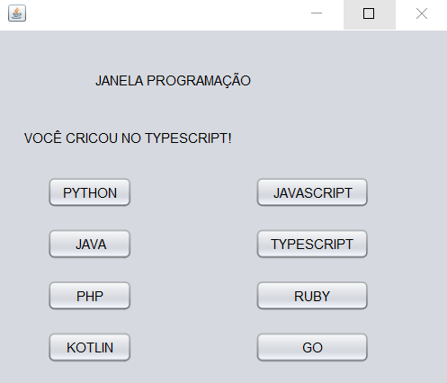

# JANELA DE PROGRAMACAO
👨‍🏫JANELA DE LINGUAGENS DE PROGRAMAÇÃO COM JAVA-SWING.

  
  

## DESCRIÇÃO:
- Este projeto é uma aplicação de interface gráfica em Java Swing que simula uma janela de programação com botões para várias linguagens de programação. 

- Esta aplicação é uma demonstração simples de interface gráfica em Java Swing, mostrando como responder a eventos de clique em botões e atualizar a interface com base nas ações do usuário. É útil para iniciantes em Java Swing e também pode ser expandida para incluir mais funcionalidades e linguagens de programação.

## FUNCIONALIDADES:
1. **Janela de Programação:** A interface gráfica apresenta o título "JANELA PROGRAMAÇÃO" no topo da janela.

2. **Botões de Linguagens de Programação:** Há botões para várias linguagens de programação, incluindo Python, Java, PHP, Kotlin, JavaScript, TypeScript, Ruby e Go.

3. **Exibição de Resultados:** Quando um botão de linguagem de programação é clicado, a mensagem "VOCÊ CRIOU NO `Linguagem`" é exibida na área de resultado, onde `Linguagem` é a linguagem de programação correspondente ao botão clicado.

4. **Funcionalidade dos Botões:** Cada botão está associado a um evento de clique que atualiza a área de resultado com a mensagem correspondente à linguagem de programação selecionada.

5. **Configuração de Aparência:** A aplicação usa o estilo de aparência Nimbus (LookAndFeel) por padrão, mas isso pode ser alterado nas configurações do código.

## ABRINDO O PROJETO NO NETBEANS IDE:
   1. **Inicie o NetBeans:**
      Abra o NetBeans IDE a partir do menu Iniciar (Windows) ou do lançador de aplicativos (macOS).

   2. **Navegue até o Projeto:**
      No menu superior, clique em "Arquivo" (ou "File" em inglês) e escolha "Abrir Projeto" (ou "Open Project").

   3. **Selecione o Diretório do Projeto:**
      Navegue até o diretório `CODIGO`, onde está localizado o projeto e selecione a pasta principal. Esta pasta contém o arquivo `pom.xml`.

   4. **Abra o Projeto:**
      Selecione a pasta do projeto e clique em "Abrir" (ou "Open" em inglês).

   5. **Aguarde a Abertura:**
      O NetBeans irá carregar o projeto. Isso pode levar alguns momentos, dependendo do tamanho do projeto e da velocidade do seu computador.

   6. **Projeto Aberto:**
      Uma vez que o projeto é carregado com sucesso, ele aparecerá no painel "Projetos" no canto esquerdo do IDE, e você poderá executa-lo clicando em `Run`.

## TECNOLOGIAS USADAS:
- [LINGUAGEM JAVA:](https://github.com/VILHALVA/CURSO-DE-JAVA) A linguagem de programação Java é amplamente utilizada para o desenvolvimento de aplicativos devido à sua portabilidade, segurança e robustez. Ela é uma escolha popular para desenvolver aplicativos desktop, web e móveis.

- [JAVA SWING:](https://github.com/VILHALVA/CURSO-DE-JAVA-SWING) Java Swing é um conjunto de bibliotecas gráficas para a criação de interfaces de usuário (UI) em Java. Ele fornece componentes gráficos avançados, como botões, caixas de texto, tabelas e muito mais, permitindo que os desenvolvedores criem aplicativos desktop com uma interface de usuário rica e interativa.

- [NETBEANS IDE](https://netbeans.apache.org/download/index.html) O NetBeans IDE é um ambiente de desenvolvimento integrado gratuito e de código aberto para o desenvolvimento de aplicativos Java, bem como para várias outras linguagens de programação, como PHP, C/C++, e HTML5. Ele oferece uma série de recursos poderosos, como edição de código avançada, depuração, controle de versão e integração com servidores de aplicativos, facilitando o desenvolvimento de software em Java e outras plataformas.

## CREDITOS:
- [PROJETO CRIADO PELO VILHALVA](https://github.com/VILHALVA)

